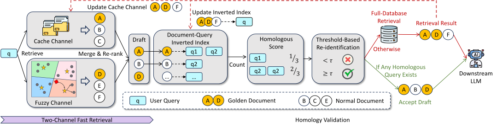
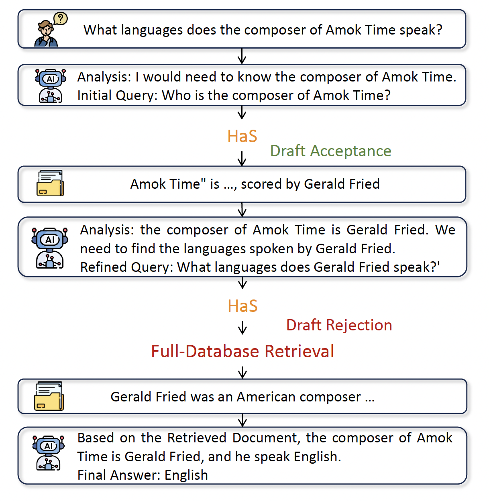

<div align="center">

# 🚀 HaS: Accelerating RAG through Homology-Aware Speculative Retrieval

[](http://arxiv.org/abs/2604.20452)
[](./LICENSE)
[](https://www.python.org/)
[](https://github.com/ErrEqualsNil/HaS)

🎉 **Accepted at ICDE 2026 (Montréal, Canada).**

> A plug-and-play speculative retrieval service that cuts retrieval latency by **23.74%–36.99%** on single-hop QA, and up to **69.4%** on multi-hop agentic RAG — with only a **1–2% accuracy drop**.

</div>

---

## ✨ Method

Retrieval has become the dominant latency bottleneck in modern RAG. Borrowing the idea of *speculative decoding*, **HaS** replaces every full-database lookup with a *cheap draft + lightweight validation*:

<div align="center">
  
</div>

1. **🔀 Two-channel fast retrieval** produces a draft over a restricted scope:
   - **Cache channel** — documents previously retrieved for recent queries.
   - **Fuzzy channel** — an aggressively configured ANNS over a narrow subset.
2. **✅ Homology validation** tries to *re-identify a homologous re-occurence*. If the current query is a homologous re-occurence of any cached queries, **accept** the draft. Otherwise, fall back to full-database retrieval.

---

## 📊 Results

### HaS is Compatible to ANNS

**(a)** ANNS configured to a similar retrieval scope as HaS, used as an alternative to it. **AvgL** — Average end-to-end retrieval Latency (seconds). **RA** — Response Accuracy.

| Method   | Granola-EQ<br>AvgL(s)&nbsp;↓ | Granola-EQ<br>RA&nbsp;↑ | PopQA<br>AvgL(s)&nbsp;↓ | PopQA<br>RA&nbsp;↑ |
|----------|:----------------------------:|:-----------------------:|:-----------------------:|:------------------:|
| IVF      | 0.0921                       | 0.4283                  | 0.0916                  | 0.2569             |
| ScaNN    | 0.0802                       | 0.4353                  | 0.0778                  | 0.2524             |
| **HaS**  | 1.0559                       | **0.4829**              | 0.8725                  | **0.2906**         |

➡️ Under a similar narrow scope, ANNS suffers >10% accuracy degradation while HaS preserves accuracy via validation. 

**(b)** ANNS with a tuned parameters, used as a replacement for full-DB retrieval. **AvgL** — Average end-to-end retrieval Latency (seconds). **RA** — Response Accuracy

| Method          | Granola-EQ<br>AvgL(s)&nbsp;↓ | Granola-EQ<br>RA&nbsp;↑ | PopQA<br>AvgL(s)&nbsp;↓ | PopQA<br>RA&nbsp;↑ |
|-----------------|:----------------------------:|:-----------------------:|:-----------------------:|:------------------:|
| IVF             | 0.5431                       | 0.4824                  | 0.5432                  | 0.2825             |
| **HaS + IVF**   | **0.4603**<br>*(−15.24%)*    | 0.4786<br>*(−0.79%)*    | **0.3872**<br>*(−28.73%)* | 0.2784<br>*(−1.48%)* |
| ScaNN           | 0.3554                       | 0.4824                  | 0.3553                  | 0.2862             |
| **HaS + ScaNN** | **0.3285**<br>*(−7.55%)*     | 0.4790<br>*(−0.70%)*    | **0.2904**<br>*(−18.27%)* | 0.2812<br>*(−1.76%)* |


➡️ With a tuned scope, ANNS and HaS are **complementary** — stacking them yields an extra **7–28%** latency reduction.

### HaS vs. reuse-based methods


| Method                 | Granola-EQ&nbsp;⋆<br>AvgL(s)&nbsp;↓ | RA&nbsp;↑<br>Qwen3-8B | RA&nbsp;↑<br>Llama3-8B | RA&nbsp;↑<br>Mistral-7B | PopQA&nbsp;⋆<br>AvgL(s)&nbsp;↓ | RA&nbsp;↑<br>Qwen3-8B | RA&nbsp;↑<br>Llama3-8B | RA&nbsp;↑<br>Mistral-7B |
|------------------------|:-----------------------------------:|:--------------------:|:---------------------:|:----------------------:|:------------------------------:|:--------------------:|:---------------------:|:----------------------:|
| Full-DB Retrieval      | 1.3845                              | 0.4875               | 0.4715                | 0.4806                 | 1.3847                         | 0.2970               | 0.2780                | 0.2703                 |
| Proximity              | 1.3186<br>*(−4.76%)*                | 0.4824               | 0.4656                | **0.4764**             | 1.1328<br>*(−18.19%)*          | 0.2802               | 0.2614                | 0.2522                 |
| MinCache               | 1.3044<br>*(−5.78%)*                | 0.4746               | 0.4590                | 0.4679                 | 1.0437<br>*(−24.63%)*          | 0.2676               | 0.2452                | 0.2360                 |
| SafeRadius             | 1.2870<br>*(−7.05%)*                | 0.4779               | 0.4603                | 0.4718                 | 0.9773<br>*(−29.42%)*          | 0.2649               | 0.2477                | 0.2338                 |
| LLM validator from CRAG  | 1.5196<br>*(+9.76%)*                | 0.4702               | 0.4549                | 0.4625                 | 1.8186<br>*(+31.33%)*          | 0.2885               | 0.2706                | 0.2542                 |
| **HaS**                | **1.0559**<br>***(−23.74%)***       | **0.4829**           | **0.4667**            | 0.4755                 | **0.8725**<br>***(−36.99%)***  | **0.2906**           | **0.2720**            | **0.2638**             |

➡️ HaS achieves the **largest latency reduction** while preserving accuracy across all three LLMs.

### 🧩 Use Case — Plug HaS into Agentic RAG to solve complex queries

HaS is a **drop-in component** — any modern RAG pipeline can simply route its retrieval to HaS. With built-in query-decomposition mechanisms, complex multi-hop queries can be solved iteratively, with **each sub-query independently accelerated by HaS**.


<div align="center">
  
</div>

---

## 🗂️ Repository Layout

```
open_sourced_core_code/
├── src/
│   ├── FullDatabaseRetrievalService/   # Cloud-side full-DB retrieval (Flask service on :6000)
│   ├── SpeculativeRetrievalService/    # Edge-side HaS speculative retrieval (Flask service on :5999)
│   ├── User_Client/                    # Client that issues queries and records latency / hits
│   ├── Evaluate/                       # Offline LLM answering + metrics over run records
│   └── utils/                          # Encoder, FAISS/HNSW indexes, LLM client, logger, I/O helpers
├── requirements.txt
└── README.md
```

---

## ⚙️ Installation

```bash
# Python 3.10+
pip install -r requirements.txt
```
---

## 📦 Data Preparation

All services and scripts expect the corpus and its embeddings under `data/enwiki_20231101/`:

```
data/
└── enwiki_20231101/
    ├── corpus.jsonl                 # one doc per line: {"id": int, "title": str, "text": str, ...}
    ├── corpus_embeddings.npy        # shape [N, 768] — pre-encoded with the embedder below
    ├── corpus_ids.npy               # shape [N]     — parallel to the embeddings
    └── corpus_line_offset.pkl       # byte offsets per line (built below)
```

Build the line-offset index once so downstream scripts can randomly access corpus lines in O(1):

```bash
python -m src.Evaluate.build_line_offset_index
```

Evaluation query sets live under `data/popqa_augmented/`:

```
data/popqa_augmented/
├── data.jsonl          # query set: {"id": int, "question": str, "answers": [str, ...], ...}
└── run_record/         # per-run outputs written by User_Client/main.py
```

---

## 🚀 Running HaS End-to-End

Start the two services in separate terminals, then run the client.

**Terminal 1 — Full-DB retrieval service (cloud):**
```bash
python -m src.FullDatabaseRetrievalService.app
# serves POST /search on 0.0.0.0:6000
```

**Terminal 2 — Speculative retrieval service (edge):**
```bash
python -m src.SpeculativeRetrievalService.app
# serves POST /search on 0.0.0.0:5999
# internally calls the cloud service at http://127.0.0.1:6000/search
```

**Terminal 3 — User client (issues queries, records latency + hit info):**
```bash
python -m src.User_Client.main --n_docs 10 --prefix HaS
# reads  data/popqa_augmented/data.jsonl
# writes data/popqa_augmented/run_record/<prefix>_<timestamp>.jsonl
```

Each record in the output jsonl extends the original query with:
- `rag_time_cost` — client-measured round-trip + simulated network latency.
- `doc_ids` — retrieved document ids.
- `is_speculative_retrieval_match` — `True` if HaS accepted the speculative draft, `False` if it fell back to full-DB retrieval.
- `similar_query_info`, `similar_score` — the homologous cached query and its validation score (when matched).


---

## 📈 Evaluation

After one or more runs have produced records under `data/popqa_augmented/run_record/`, evaluation is a two-step pipeline: generate LLM answers for each retrieved context, then compute metrics.

**Step 1 — Generate LLM responses for each run record.**

Edit the top of [src/Evaluate/get_llm_resp.py](src/Evaluate/get_llm_resp.py) to point at your OpenAI-compatible endpoint:
```python
api      = "<YOUR_API_KEY>"
url      = "<https://your-openai-compatible-endpoint/v1>"
llm_name = "Qwen/Qwen3-8B"           # or any model your endpoint serves
```
Then run:
```bash
python -m src.Evaluate.get_llm_resp
# reads  data/llm_resp_cache/run_record/*
# writes data/llm_resp_cache/record_after_qwen/*
# caches prompt→response pairs in data/llm_resp_cache/qwen_cache.json
```
The cache is keyed by a stable MD5 hash of the full prompt, so re-runs across different retrieval configurations reuse prior LLM outputs instead of re-querying the model.

**Step 2 — Compute metrics over the answered records.**
```bash
python -m src.Evaluate.evaluate_record
# reads  data/popqa_augmented/record_after_qwen/*
# writes data/popqa_augmented/record_after_qwen/results.csv
```

`results.csv` contains, per run:
- `average_time_cost` — mean end-to-end retrieval latency (s).
- `response_hit_rate` — answer-level accuracy (EM against `answer_list`).
- `document_hit_rate` — top-10 document recall against gold doc ids.
- `cache_hit_rate` — fraction of queries served by the speculative (cache+fuzzy) channel.
- `cache_hit_correct_rate` — accuracy *conditioned on* a speculative hit.
- `response_hit_rate_for_cache_hit_record` — answer accuracy restricted to speculative-hit queries.

---

